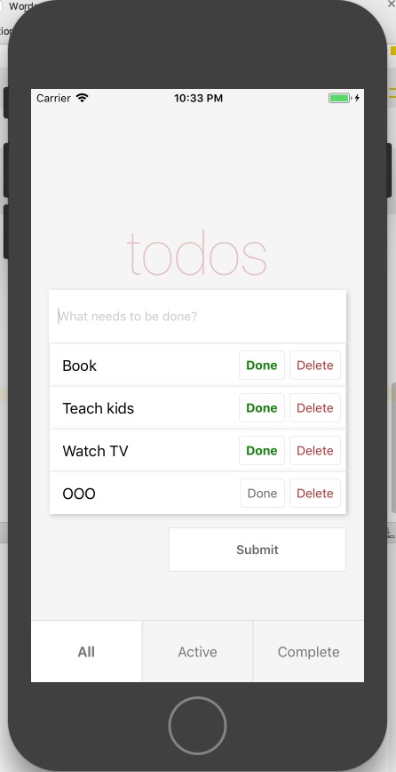

React Native TodoApp
==



## Environment

1. React 16+
2. React Native 0.51.0

## Getting started

```bash
npm config set registry https://registry.npm.taobao.org
cat ~/.npmrc
react-native init TodoApp
```

